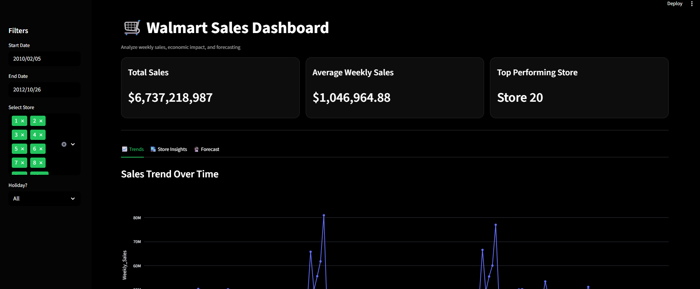
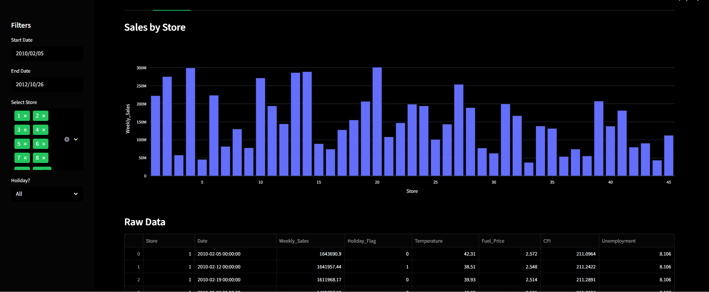
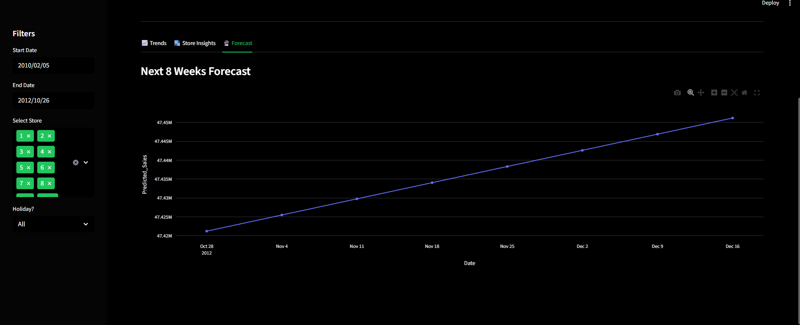

# 🛒 Sales Data Analysis & Forecasting Dashboard

An interactive, sales analytics dashboard built using Python and Streamlit to analyze historical sales data and forecast future trends for data-driven decision-making.

---

## 📌 Project Overview

This project analyzes weekly sales data across multiple stores to uncover trends, compare store performance, and predict future sales. The dashboard provides interactive filters, key performance indicators (KPIs), visual analytics, and a machine learning–based sales forecast.

---

## ✨ Features

- Interactive dark-themed dashboard
- Key Performance Indicators (KPIs)
  - Total Sales
  - Average Weekly Sales
  - Top Performing Store
- Date range, store, and holiday-based filters
- Sales trends over time
- Store-wise sales comparison
- Raw data exploration
- Sales forecasting for upcoming weeks using Linear Regression

---

## 🛠️ Tech Stack

- Python
- Streamlit
- Pandas
- NumPy
- Plotly
- Scikit-learn

---

## 📂 Project Structure

```text
sales-dashboard/
│
├── dashboard.py
├── requirements.txt
├── README.md
│
├── data/
│   └── sales.csv
│
├── screenshots/
│   ├── dashboard_overview.png
│   ├── kpi_section.png
│   ├── forecast.png
│   └── project_structure.png
│
└── .streamlit/
    └── config.toml


## ▶️ How to Run the Project

1. Clone the repository
2. Install dependencies:

3. Run the dashboard:
   streamlit run dashboard.py

   
---

## 📈 Future Enhancements

- Advanced forecasting models (ARIMA / Prophet)
- Deployment on Streamlit Cloud
- Export reports (PDF / CSV)
- Additional visual insights

---


## 📸 Screenshots

### Dashboard Overview


### Key Performance Indicators


### Sales Forecast



## 👩‍💻 Author

**Rajashri Khetmalis**  
Final Year Computer Engineering Student
